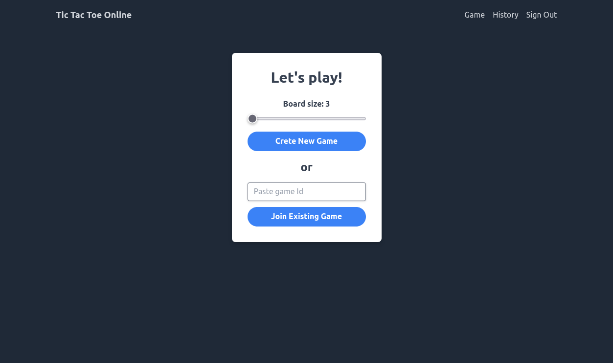

# Task: Developing a Tic-Tac-Toe Web App

## Running project
### Requirements
- docker

### Running production
- Project setup is fully automated, to test application we need to run:
```sh
docker compose up
```
### Running development
Install modules in `client` and `server` directories.
#### Set up database
In the main project folder run:
```sh
docker compose up postgres
```
When database is created we need to run migrations against it
From a `server` folder run:
```sh
npm run db:migrate
```
#### Running client
From the `client` directory run:
```sh
npm start
```
Client application will be available on `localhost:3000`

#### Running server
From `server` directory run:
```sh
npm run dev
```
Server will be available on `localhost:8000`

## Screenshots
### Desktop




### Mobile


## TODOs:
- Handle different board sizes,
- Better client and server error handling,
- Rmove clients from game on disconnect,
- Remove game from game controller when no players connected (memory footprint, leaks)
- Use single WebSocket for handling connections (without gameId path param),
- Move common game code to shared namespace,
- Client performance, not slow - but also not optimized,
- Add more integration and E2E tests,
- Display matches history,
- Use Zod schema for configuration validation,
- Validate user inputs on auth endpoints,

## Description:

Your objective is to create a web application for the classic Tic-Tac-Toe game, featuring a login mechanism and online game initiation. The aim is to deliver a user-friendly and engaging Tic-Tac-Toe experience.

## Requirements:

Implement the following functionalities:

1. **User Authentication:**
  
  - Develop a secure user authentication system for account creation and login.
  - Ensure privacy and security during user authentication.
2. **Online Game Mechanism:**
  
  - Create multiplayer Tic-Tac-Toe gameplay on the web platform.
  - Allow users to start online matches and play against each other in real-time.
  - Implement an efficient matchmaking system for connecting players.
3. **Testing and Debugging:**
  
  - Conduct thorough testing to identify and resolve bugs.
  - Implement error handling mechanisms to enhance app stability.
4. **Documentation:**
  
  - Provide comprehensive documentation for the codebase, APIs, and any external libraries.
  - Include clear instructions for future development or modifications.

## Additional Guidelines:

- Prioritize clean, modular, and maintainable code.
- Adhere to RESTful best practices and naming conventions.
- Employ proper error handling techniques.
- Create a README file with setup and run instructions.
- Utilize any relevant web development libraries or frameworks.
- If applicable, detail the setup and operation of any used databases.

## Bonus Task:

- **Match History Tracker:**
  - Implement a bonus feature that records and stores completed Tic-Tac-Toe matches.
  - Include match outcomes, player details, and timestamps.
  - Design an accessible interface for reviewing match history.

## Evaluation Criteria:

We'll evaluate your solution based on the following criteria:

- Correctness: Does the app meet all requirements and function as expected?
- Code quality: Is the code well-structured, readable, and maintainable?
- Testing: Are there appropriate tests ensuring the app's functionality?
- Error handling: Does the app effectively manage errors and edge cases?

## Submission:

Please establish a GitHub (GitLab or BitBucket) repository and share it with us, including instructions for local project execution.

For any inquiries or clarifications, don't hesitate to reach out.
